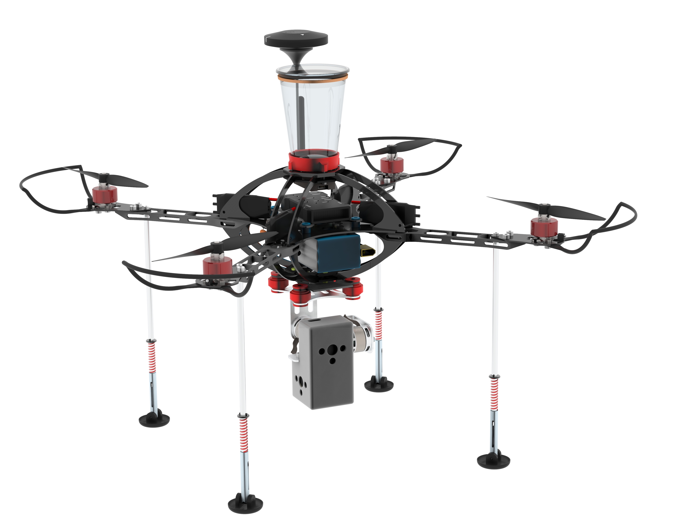

# PREN_2
> This is the official repo of the PREN 2 project conducted at the HSLUInformatik and the HSLU T&A by group 40.

**Members**:
* David Gut
* Oliver Werlen
* Frank Gfeller
* Dominic Bacher
* Simon In-Albon
* Rahul Pucadyil
* Martin Portmann

The solution proposed by team 40 is a **drone** based on the **PX4** Architecture.

This repo hosts the python code used to autonomously navigate the drone trough a parcour as well as some project guidelines regarding the development part. 

## Guidelines

### Project Structure
The project consists of folders for the different parts. **Never** is a file just placed at the root level! It has to be placed inside an appropriate folder or if such a folder doesn't exists, it shall be created.

    /demo: This folder is used to store all demo files 
    /images: This folder is used to store all project related images
    /project: This is the main folder that hosts all the code 

### Git 
There are some basic rules that should be common sense, nevertheless here are the most important ones

- Every commit contains a usefull and comprehensible comment
- Everything that is pushed to this repository should be partially functionable (basic qualitiy)
- You **NEVER** commit directly to the master branch during development (During setup phase this can differ). 

There are 2 main branches:
- master
- develop

The master branch contains only tested and fully functionable code. Thus it is protected and content can only be merged via merge request.
The develop branch contains code that is subject to change but is stable.

#### Workflow
If you start development:
- Create a new local branch following following the name schema

        pren_TOPIC

    where TOPIC is a quick explanaiton of the work. Example: **pren_pi_connection**
- Do all your work on this branch and commit your local changes from time to time
- Push your local changes to the repo if an increment is done.
- If the work on this branch is finished, merge it into develop
- If your branch is merged to develop, delete the branch (remote and locally)

## License

